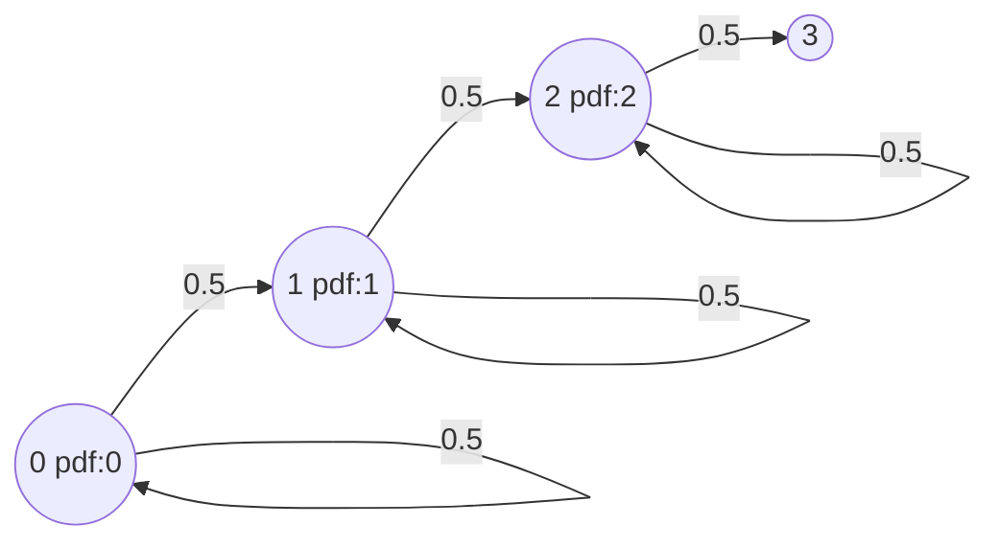

# Kaldi 底层代码-HMM

***

> [Kaldi文档中的HMM](http://kaldi-asr.org/doc/hmm.html)

## 0. HMM topology(拓扑结构) and transition modeling

### 0.1 Introduction

In this page we describe how HMM topologies are represented by Kaldi and how we model and train HMM transitions. 

### 0.2 HMM topologies

The class HmmTopology is the way the user specifies to the toolkit the topology of the HMMs the phones. In the normal recipe, the scripts create in a file the text form of the HmmTopology object, which is then given to the command-line programs. To give some idea of what this object contains, below is the text format for the HmmTopology object in the "normal" case (the 3-state Bakis model):

```
 <Topology>
 <TopologyEntry>
 <ForPhones> 1 2 3 4 5 6 7 8 </ForPhones>
 <State> 0 <PdfClass> 0
 <Transition> 0 0.5
 <Transition> 1 0.5
 </State>
 <State> 1 <PdfClass> 1
 <Transition> 1 0.5
 <Transition> 2 0.5
 </State>
 <State> 2 <PdfClass> 2
 <Transition> 2 0.5
 <Transition> 3 0.5
 </State>
 <State> 3
 </State>
 </TopologyEntry>
 </Topology>
```

在上面这个例子中，有8个音素，描述的图如下：



> The probabilities given in the [HmmTopology](http://kaldi-asr.org/doc/classkaldi_1_1HmmTopology.html) object are those that are used to initialize training; the trained probabilities are specific to the context-dependent HMMs and are stored in the [TransitionModel](http://kaldi-asr.org/doc/classkaldi_1_1TransitionModel.html) object. 
>
> The [HmmTopology](http://kaldi-asr.org/doc/classkaldi_1_1HmmTopology.html) object specifies a prototype HMM for each phone.


### 0.3 Pdf-classes

The [HmmTopology](http://kaldi-asr.org/doc/classkaldi_1_1HmmTopology.html) object specifies a prototype HMM for each phone.


### 0.4 Transition models (the TransitionModel object)

The [TransitionModel](http://kaldi-asr.org/doc/classkaldi_1_1TransitionModel.html) object stores the transition probabilities and information about HMM topologies (it contains a [HmmTopology](http://kaldi-asr.org/doc/classkaldi_1_1HmmTopology.html) object).

数据定义如下：


## 1. `hmm-topology.h`和`hmm-topology.cc`

**HmmTopology** 类

> * 作用： A class for storing topology information for phones.

在这个类中定义了一个**HmmState** 

```c++
struct HmmState{
    int32 forward_pdf_class;
    int32 self_loop_pdf_class;
    std::vector<std::pair<int32, BaseFloat> > transitions;
    HmmState(): forward_pdf_class(-1), self_loop_pdf_class(-1) { }
}
```

